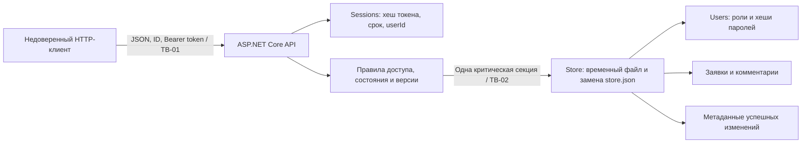

# Модель угроз

## Модель продукта

**Что существует:** все показанные компоненты; сервер запускается, оба сценария реализованы. Реального frontend и сетевого выпуска нет.

**Что планируется позднее:** проверки истечения сессии управляемым временем,
долговременной нагрузки, устойчивости к сбоям ОС; расширение продукта по заданиям курса.

**Допущения:** один процесс API владеет файлом; сервер работает на loopback;
все аккаунты и обращения учебные; ОС и оператор стенда доверены; operator вправе
читать все обращения; внешние пользователи не имеют доступа к каталогу хранения.
Публичные демонстрационные пароли не применяются для реальных данных или сетевого выпуска.

## Границы доверия

| Граница | Стороны и передаваемые данные | Причина проверки |
| --- | --- | --- |
| TB-01 | Клиент → API: login/password, bearer token, ID, текст, статус, expectedVersion | Клиент контролирует запрос целиком; ID и поля не подтверждают идентичность или права |
| TB-02 | Логика API → файловое хранилище: пользователи, заявки, комментарии, аудит | Успешное изменение памяти не подтверждает успешную запись; файловая операция может завершиться ошибкой |

Внутри API граница между данными клиента и доверенной идентичностью проходит через
проверку Sessions и загрузку активного User из Store. Роль из запроса не принимается.
Объекты и последствия — [PROJECT.md](../PROJECT.md#5-значимые-данные-и-другие-объекты).

## Угрозы

| ID | Конкретный сценарий и нарушаемое свойство | Граница / точка входа | Приоритет и обоснование |
| --- | --- | --- | --- |
| T-01 | bob подставляет ID заявки alice в получение/редактирование или в endpoint комментариев и раскрывает либо меняет чужое обращение | TB-01, /tickets/{id}, /comments, список | **Высокий, приоритетная:** известный ID не секрет; атака проста и нарушает ключевую изоляцию |
| T-02 | user передаёт ownerId/role/status в JSON или вызывает операторскую смену статуса; сервер доверяет вводу и создаёт чужую заявку либо выдаёт привилегию | TB-01, POST /tickets, PATCH /status, GET /audit | **Высокий, приоритетная:** прямой обход различия полномочий |
| T-03 | Клиент подбирает пароль, использует вымышленный или отозванный/истёкший токен; сервер принимает его за активную сессию | TB-01, /auth/login, Authorization | **Высокий, приоритетная:** все последующие права зависят от идентичности; отозванная сессия должна перестать работать |
| T-04 | Автор и оператор работают с одной версией. Проверка New выполнена заранее; оператор принимает заявку, затем автор сохраняет текст и скрыто меняет уже принятый предмет обработки | TB-01, PATCH /tickets/{id}, PATCH /status; общая запись | **Высокий, приоритетная:** реалистичное совпадение запросов; теряются согласованное состояние и смысл работы оператора |
| T-05 | Клиент посылает огромный/неполный JSON, неизвестные поля или чрезмерный текст; сервер сохраняет непригодные данные либо расходует лишние ресурсы | TB-01, все JSON-операции | **Средний:** размер и формат реально контролируются клиентом; размер тела и поля уже ограничены сервером, но для стенда последствия ниже нарушения прав |
| T-06 | API возвращает User с хешем пароля или обработчик ошибки/аудит сохраняет token и текст обращения; другой пользователь получает секреты или содержание | TB-01 ответы /me, /auth/login, /audit; диагностика | **Средний:** отсутствие прямой публикации технических объектов проверяемо; журнал не предназначен для пользователя |
| T-07 | Клиент массово создаёт заявки или вызывает дорогую проверку пароля; растут файл, память и время ответа | TB-01, /auth/login, POST /tickets | **Средний:** локальная граница снижает реалистичность внешней атаки. Лимит входа и тела покрывают часть угрозы; общий рост данных остаётся риском |
| T-08 | При изменении заявки запись файла завершается ошибкой, но память уже изменена или аудит сохранён отдельно; клиент видит успех/событие для незафиксированной операции | TB-02, Store.WriteAsync | **Высокий, приоритетная:** обычный сбой диска/доступа разрушает согласованность, даже без злонамеренного клиента |

## Приоритетный набор

Выбраны T-01, T-02, T-03, T-04, T-08: изоляция пользователей, привилегии, идентичность
и целостность записи необходимы для обоих основных сценариев. Угроза T-08 может
возникнуть случайно — модель включает условия сбоя, а не только атаки.

В текущем коде используются проверка серверной сессии, разграничение доступа
к объектам, контроль версии и совместная запись состояния с аудитом.
T-05/T-06 также частично покрыты ограничением ввода и исключением секретов из
публичных ответов; средний приоритет не означает отсутствия защиты.
Для T-07 признан непокрытый риск общего роста данных.

До сетевого выпуска приоритет T-07 и риск передачи токена по HTTP должны быть
пересмотрены. Атака администратора ОС на сам файл находится вне выбранной модели,
и аудит не заявлен как защищённый от владельца компьютера.
